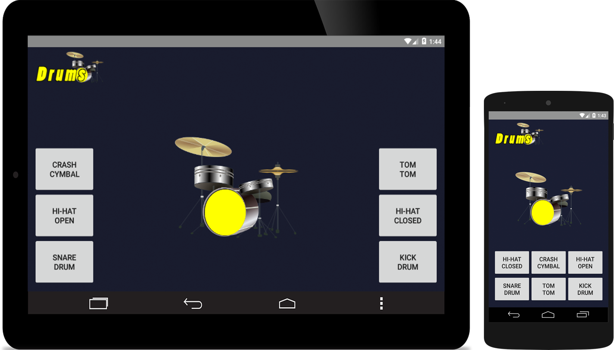

# drums

<h1>Drums</h1>
<h2>Android App</h2>

<h4>Objective</h4>

The goal of this was to build a simple Android App that I can deploy to the Google Play Store

<h4>My Solution</h4>

... 

<h4>The Result</h4>

I was able to make a simple Android App and deploy it to the Google Play Store for free downlaod.

